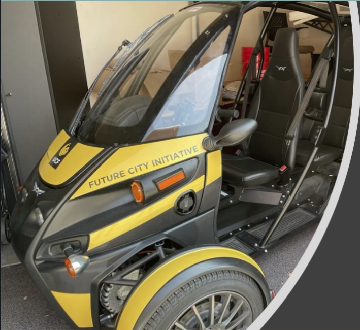

# SenseRator


## Table of Contents
- [What is SenseRator?](#what-is-senserator?) 
- [Quick start](#quick-start)
	- [With Conda](#with-conda)
- [Usage](#usage)
    - [Training the Semantic Segmentation Model](#training-the-semantic-segmentation-model)
    - [Visualizing Predictions](#visualizing-predictions)
- [Data](#data)
- [Directory Structure](#directory-structure)
- [Members](#members)

## What is SenseRator? 
The SenseRator is a small, sensor-equipped electric vehicle designed for disaster management and terrain mapping. This vehicle, equipped with cameras and LIDAR technology, is tasked with gathering comprehensive environmental data. 

The SenseRator is engineered to perform state-of-the-art object detection. It is specifically trained to identify disaster damage, particularly focusing on flooding, potholes, and fallen trees. This is crucial for assessing post-disaster scenarios where such information is vital for rescue and recovery operations.

Additionally, the algorithm integrates the collected data to provide a detailed semantic understanding of the environment, which can be instrumental for planning rescue efforts.

In summary, the SenseRator is an advanced AI-powered sensor platform that can provide immediate, actionable intelligence in disaster-stricken areas.

## Quick Start
### With Docker
**WIP**
### With Conda
1. Open terminal or Anaconda Prompt
2. Navigate to the directory containing the `environment.yml` file.
1. Create the environment using the following command:    

```bash
conda env create -f environment.yml
```

This command will set up a new Conda environment identical which should work to run all parts of the project (**with the exception of Open3D / LIDAR.**)

### Without Docker or Conda
1. [Install CUDA](https://developer.nvidia.com/cuda-downloads)
    
2. [Install PyTorch 1.13 or later](https://pytorch.org/get-started/locally/)
    
3. Install dependencies
    

```shell
pip install -r requirements.txt
```

4. Download the data and run training:

``` 
scripts/download_data.sh
```
## Usage
**WIP**

**Note: Use Python 3.X**
### Training the Semantic Segmentation Model
WIP

### Visualizing Predictions
WIP

## Data
The Camvid dataset used for training the semantic segmentation module of the SenseRator project is available on the [Kaggle website](https://www.kaggle.com/datasets/carlolepelaars/camvid). 

You can also download it using the helper script:
```
scripts/download_data.sh
```

The completed data directory should appear as follows: 
```
.
└── data/
    ├── camvid/
    │   ├── images
    │   └── labels
    ├── train
    ├── train_labels
    ├── val
    ├── val_labels
    └── class_dict.csv
```

## Directory Structure
```
.
├── data                            # Contains camvid dataset
├── processed_masks                 # Output folder for semseg masks
├── scripts                         # Utility scripts
│   ├── download_data.sh            # Shell script for downloading CamVid dataset
│   ├── inspect_pt_file.py          # Script for inspecting the contents of a .pt file
│   ├── create_diagrams.py          # Script for creating various project-related diagrams using graphviz
├── semseg/                         # Code needed for Semantic Segmentation
│   ├── batch_segment.py            # Segments a directory full of images
│   ├── dataset.py                  # Dataset loader for CamVid dataset
│   ├── evaluate.py                 # Evaluate the DeepLabV3 model
│   ├── model.py                    # Setup and utility functions for the semantic segmentation model
│   ├── preprocess_images.py        # Loads, transforms, and saves images with their corresponding labels for training
│   ├── segment.py                  # Segments one image specified by the arguments
│   └── train.py                    # Trains a modified DeepLabV3 semantic segmentation model
├── config.py                       # Config file for the object detection model
├── lidar_pcap_converter.py         # Utility functions for converting LiDAR .pcap files to .pcd or .ply files
├── event_handlers.py               # GUI-related event handlers (help, about)
├── UltralyticsModel_snapshot.pt    # Custom YOLO dictionary containing: epoch, best_fitness, model, etc. 
├── gui_utils.py                    # GUI-related utilities (folder select, open windows)
├── image_processing.py             # Various image-processing utilities for images and pcap files
├── lidar_visualization_gui.py      # GUI and utilities for visualizing LIDAR
├── main.py                         # Runs the GUI application and handles events for entire program
├── object_detection.py             # Runs object detection using YOLO
├── timestamp_utils.py              # Extracts timestamp for video playback
├── video_player.py                 # Implements a class for video player functionality 
└── gui_media_visualization.py      # Provides GUI for media playback 
```

## Members:
The SenseRator was a Senior Design project at UCF for the Spring 2023 - Fall 2023 semesters. We were delighted to be included in the semi-finalist's showcase. Listed below are the members of our team and their areas of focus for this project. 

- Alex Varga - Project Manager, Front End, Hardware
- Alek Dussuau - Backend, Data Collection
- Gabriela Shamblin - Front End, Point Cloud Renders
- Jose Puche - Backend, Object Detection
- Trevor Geiger - Backend, Semantic Segmentation